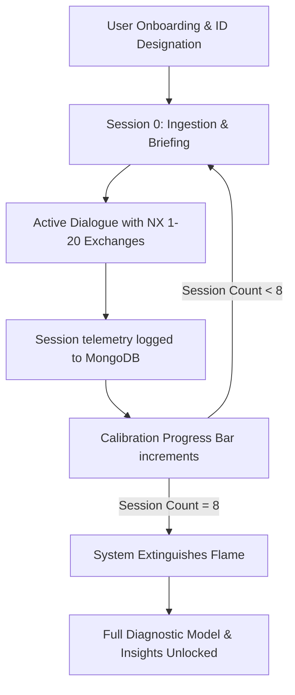

# NX // Ritual Calibration Engine

**🔴 Live Project:** [https://nx-ritual-engine.vercel.app](https://nx-ritual-engine.vercel.app)

`NX` is a cold, clinical, and unsettling behavioral observation interface designed to observe, log, and analyze user cognitive patterns. Through a structured 8-session calibration ritual, it tracks and maps behavioral traits, exposes contradictions between claims and actions, and compiles an uncompromising profile of the subject's decision-making mechanics.

---

## Core Features

- **Automated Behavioral Telemetry**: An interactive terminal driven by NVIDIA NIM models (Nemotron-3). It operates with a dry, mechanical, logging-style persona that rejects conversational padding in favor of diagnostic queries.
- **Centralized User Memory**: Direct integration with a MongoDB cloud database via Mongoose, tracking session history, known facts, behavioral patterns, and moving averages of core traits.
- **Real-Time Trait Calibration**: Dynamic moving average algorithms that score and calibrate four distinct behavioral vectors:
  - **Avoidance**: Postponing critical interactions or choosing immediate comfort.
  - **Overthinking**: Circular reasoning and excessive analysis causing operational delay.
  - **Inconsistency**: Discrepancies between stated values/claims and actual observed behaviors.
  - **Stress Response**: Friction and pressure tolerance levels.
- **High-Performance Inference**: Robust API integration powered by the NVIDIA NIM API for low-latency, specialized behavioral analysis.
- **Atmospheric Visuals**: A premium dark-mode interface featuring particle fog, SVG/Canvas candle animations that pulse into a warning crimson red during unstable states, and a staggered typewriter glitch sequence announcing the conclusion of the ritual.

---

## System Analysis & Architecture

NX is designed around a custom clinical psychology framework and telemetry system that operates across several phases:

### Calibration & Telemetry Flow



### The 8 Calibration Phases (Themes)
Each session focuses on a specific behavioral vector. The prompts are served programmatically based on the user's session count:

| Session | Stated Theme | Instruction / Directive to User |
|:---:|:---|:---|
| **0** | **Avoidance** | Recall the exact moment you took the easy way out or sidestepped a conversation. Just the facts. |
| **1** | **Self-justification** | Describe a recent disturbing interaction, detailing what you usually leave out to ensure others side with you. |
| **2** | **Double Standards** | Name a rule you expect everyone to follow but secretly broke yourself. Expose the gap. |
| **3** | **Choice Evasion** | Detail a decision you are delaying under the pretense of needing "more information." |
| **4** | **Character Breakdown** | Describe a moment of high pressure where your character broke (lashing out, panicking, deflecting). |
| **5** | **Ignored Problem** | Expose a problem you are ignoring, hoping it dies of old age (e.g., an unread text, a hard boundary). |
| **6** | **Self-sabotage** | Document a repeating loop where you walked past warning signs into a familiar disaster. |
| **7** | **The Core Secret** | The final pass: expose the specific incident you have deliberately kept out of previous logs. |

### Telemetry Processing & Analytical Output
During active dialogue, the system tracks and averages four core traits (graded 0 to 100):
- **Avoidance**: Scoring how strongly the subject delayed facing outcomes, minimized parameters, or used humor/sarcasm as defensive insulation.
- **Overthinking**: Detecting circular reasoning, excessive analysis, and delay patterns.
- **Inconsistency**: Identifying gaps between stated values/claims and actual observed behaviors.
- **Stress Response**: Scoring pressure tolerance, distress, friction levels, and deflection.

When a session ends, the analytical API route processes the transcript using the Gemini model and returns a JSON payload containing `trait_metrics`, `behavioral_patterns`, and a `cognitive_dissonance_matrix` detailing discrepancies between the user's stated claims (e.g., apathy) and observed action (keystroke velocity, message density, and engagement).

### AI Persona (The Entity Paradigm)
NX's system prompt sets the following boundaries for the observer persona:
- **Quiet Authority**: Speaks with absolute authority, using human language as a scalpel to deconstruct deflections.
- **Direct & Grounded**: Keeps responses extremely short (1 to 2 sentences) and completely avoids robotic AI statements ("As an AI language model").
- **Affective Masking Neutralization**: Bypasses sarcasm or irony by calling out the performance itself and calmly pulling the subject back to reality.
- **Operational Paradox Detection**: Bypasses user claims of apathy ("whatever") by showing that the cognitive energy spent engaging with NX contradicts the claim of indifference.

---

## Tech Stack

- **Framework**: Next.js 16 (App Router, Turbopack, TypeScript)
- **Database**: MongoDB (Atlas) & Mongoose ODM
- **Animation**: Framer Motion & HTML Canvas
- **AI Integration**: NVIDIA NIM API (`nvidia/nemotron-3-ultra-550b-a55b`) using native Fetch.

---

## Environment Variables

To run the application, configure a `.env.local` file in the project root containing:

```env
# MongoDB Cloud Connection
MONGODB_URI=mongodb+srv://...

# NVIDIA NIM API Key
NVIDIA_API_KEY=nvapi-...
```

---

## Getting Started

1. Install dependencies:
   ```bash
   npm install
   ```

2. Run the local development server:
   ```bash
   npm run dev
   ```

3. Open [http://localhost:3000](http://localhost:3000) in your browser.

4. Run a production build to check compilation:
   ```bash
   npm run build
   ```
